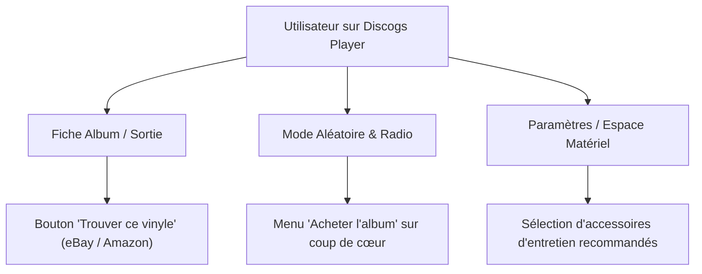

# Document de cadrage — Affiliation Discogs Player

> **Statut** : Validé pour conception  
> **Date** : 3 septembre 2026  
> **Auteur** : Équipe Produit & Ingénierie Discogs Player  
> **Cible** : Monétisation passive sans friction

---

## 1. Résumé exécutif & Vision

Discogs Player propose une expérience fluide et visuelle de parcours de collection de vinyles et d'écoute musicale.
L'affiliation a pour objectif de **monétiser le trafic existant sans barrière à l'entrée ni dégradation de l'expérience utilisateur**.

En intégrant des passerelles marchandes contextuelles (« Trouver ce vinyle », « Équiper son système d'écoute », « Protéger sa collection »), l'application répond à une intention forte des collectionneurs tout en captant des commissions sur les ventes de disques et d'accessoires.

---

## 2. État des lieux des partenaires d'affiliation

### 2.1 La situation de Discogs

- **Constat** : Discogs **ne dispose pas d'un programme d'affiliation public ouvert**. Leur programme historique est fermé aux nouveaux éditeurs tiers.
- **Stratégie** : Renvoyer vers les places de marché mondiales majeures pour l'achat de disques physiques d'occasion et neufs, et vers les distributeurs Hi-Fi pour les équipements.

### 2.2 Cartographie des régies retenues

| Régie / Partenaire             | Typologie de produits                                                  | Commission constatée | Durée du Cookie             | Pourquoi ce choix ?                                                                                 |
| :----------------------------- | :--------------------------------------------------------------------- | :------------------- | :-------------------------- | :-------------------------------------------------------------------------------------------------- |
| **eBay Partner Network (EPN)** | Vinyles d'occasion, raretés, pressages originaux, CD collector         | **1,5 % à 4 %**      | 24 heures                   | Deuxième plus grande place de marché vinyle au monde après Discogs. Incontournable pour l'occasion. |
| **Amazon Partenaires**         | Rééditions neuves, coffrets vinyles, consommables (pochettes, brosses) | **3 % à 5 %**        | 24 heures _(panier global)_ | Taux de conversion très élevé ; commission perçue sur l'ensemble du panier de l'acheteur.           |
| **Thomann**                    | Platines vinyles, cellules, diamants, équipement DJ et écoute          | **2 % à 4 %**        | 14 jours                    | Leader européen de l'audio. Paniers moyens très élevés (100 € à 700 €).                             |
| **Awin (Fnac / Cultura)**      | Vinyles neufs, exclusivités et précommandes en France                  | **3 % à 6 %**        | 30 jours                    | Forte confiance des acheteurs francophones.                                                         |

---

## 3. Points de contact & Parcours utilisateur (UX)

L'affiliation ne doit jamais être intrusive. Elle s'intègre comme un service naturel à des moments précis :



### 3.1 Fiche Album (`/sorties/[releaseId]`)

- **Emplacement** : Sous les métadonnées de l'édition (formats, label, année), à côté du bouton d'écoute.
- **Composant** : Bouton d'action secondaire :
  - _« Trouver une copie physique »_ ouvrant une modale ou un menu discret proposant :
    - _Chercher sur eBay_ (recherche ciblée sur l'artiste, l'album et le format vinyle).
    - _Chercher sur Amazon_ (recherche neuve).

### 3.2 Mode Aléatoire & Radio (`/aleatoire`, `/radio`)

- Lors de la découverte d'un morceau marquant, un clic sur la pochette ou un bouton discret dans la barre de lecture permet d'accéder au lien marchand pour acquérir le disque physique.

### 3.3 Page "Équipement & Soin du vinyle" (Section dédiée ou Paramètres)

- Guide court sur la préservation des vinyles :
  - Pochettes intérieures antistatiques (pourquoi et lesquelles acheter).
  - Brosses et entretien régulier du diamant.
  - Cellules recommandées pour débuter ou monter en gamme.
- Tous les liens vers ces produits intègrent les tags d'affiliation.

---

## 4. Architecture technique & Implémentation

### 4.1 Configuration et variables d'environnement

Centralisation des clés et tags dans `src/lib/env.ts` et `.env.local` :

```env
AFFILIATE_AMAZON_TAG="discogsplayer-21"
AFFILIATE_EBAY_CAMPAIGN_ID="53389XXXXX"
AFFILIATE_THOMANN_ID="XXXXXX"
```

### 4.2 Module dédié `src/modules/affiliate/`

- `links.ts` : Fonctions pures de génération d'URLs formatées, avec encodage robuste et injection des identifiants partenaires.
- `tracker.ts` : Enregistrement interne anonyme des clics (statistiques de conversion sans cookies tiers).
- `components/affiliate-buy-button.tsx` : Composant React accessible avec gestion automatique de `rel="noopener noreferrer sponsored"`.

```typescript
// Exemple de constructeur d'URL eBay
export function buildEbaySearchUrl(artist: string, album: string, format = 'vinyl'): string {
  const query = encodeURIComponent(`${artist} ${album} ${format}`.trim());
  const campaign = process.env.NEXT_PUBLIC_AFFILIATE_EBAY_CAMPAIGN_ID;
  return `https://www.ebay.fr/sch/i.html?_nkw=${query}&mkcid=1&mkrid=709-53476-19255-0&campid=${campaign}&toolid=10001`;
}
```

---

## 5. Conformité juridique & Bonnes pratiques

1. **Mentions légales d'affiliation (DGCCRF / FTC)** :
   - Mention visible et explicite en pied de page et dans les paramètres :  
     _« Discogs Player participe à des programmes d'affiliation conçus pour permettre aux sites de percevoir une rémunération par la création de liens vers des plateformes marchandes (Amazon, eBay, etc.), sans aucun surcoût pour l'utilisateur. »_
2. **Attributs HTML normatifs** :
   - Tout lien d'affiliation externe DOIT comporter :  
     `target="_blank" rel="noopener noreferrer sponsored"`
3. **Respect des conditions des plateformes** :
   - Ne pas inciter artificiellement au clic ("Cliquez ici pour soutenir le site").
   - Ne pas masquer l'URL finale de destination de façon trompeuse.

---

## 6. Projections financières & KPI

### 6.1 Indicateurs clés de performance (KPI)

- **CTR (Click-Through Rate)** : Objectif de 2 % à 3,5 % sur les fiches albums.
- **Conversion Rate (CR)** : 2,5 % à 4 % de ventes sur le total des clics sortants.
- **Panier Moyen (AOV)** : ~35 € pour un disque, ~80 € pour du matériel audio.

### 6.2 Modélisation des revenus

| Audience active (MAU) | Pages vues / mois | Clics sortants estimés | Ventes générées | Revenu mensuel estimé |
| :-------------------- | :---------------- | :--------------------- | :-------------- | :-------------------- |
| **500**               | 15 000            | 375                    | ~10             | **15 € - 35 €**       |
| **2 500**             | 80 000            | 2 000                  | ~60             | **90 € - 220 €**      |
| **10 000**            | 350 000           | 8 750                  | ~260            | **400 € - 1 100 €**   |

---

## 7. Plan de déploiement

1. **Phase 1 : Inscriptions et validation des comptes régies** (eBay Partner Network + Amazon Associates).
2. **Phase 2 : Développement du module `affiliate`** (générateurs d'URL + tests unitaires).
3. **Phase 3 : Intégration UI** sur la fiche album et dans les paramètres avec mention légale.
4. **Phase 4 : Mesure des premiers clics** et optimisation des libellés de boutons.
