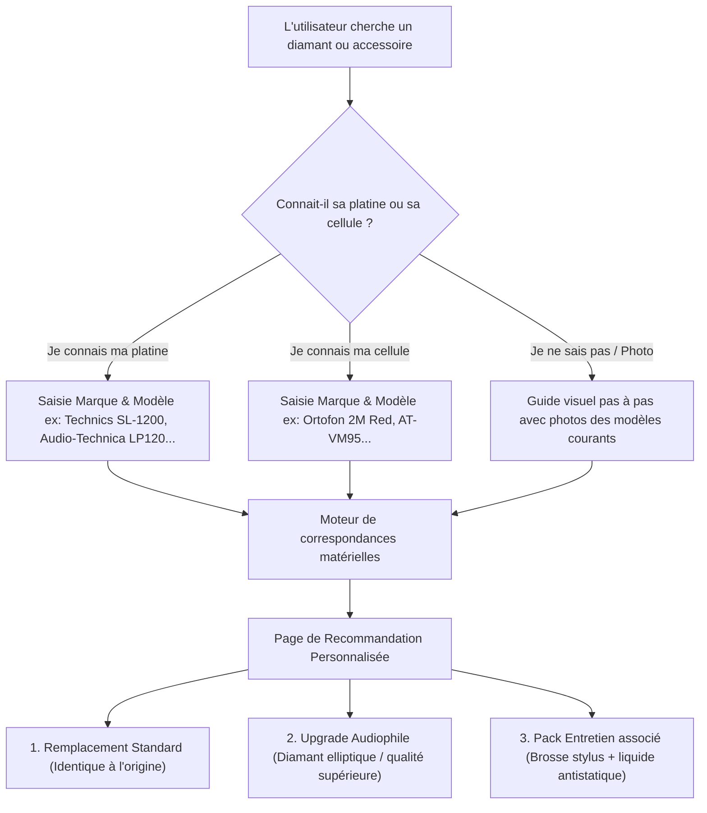
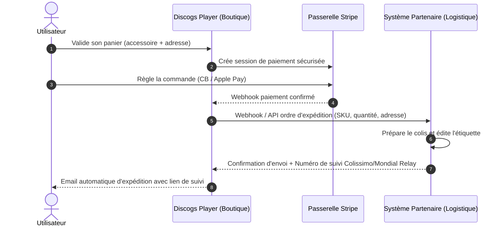

# Document de cadrage — Boutique d'accessoires & Guide matériel intelligent

> **Statut** : Validé pour conception  
> **Date** : 3 septembre 2026  
> **Auteur** : Équipe Produit & Ingénierie Discogs Player  
> **Cible** : E-commerce intégré avec partenaire logistique (Drop-fulfillment)

---

## 1. Vision & Opportunité stratégique

Discogs Player réunit une communauté très qualifiée de collectionneurs de vinyles et de passionnés de musique. Ces utilisateurs ont tous un besoin récurrent : **entretenir leurs disques et maintenir leur équipement audio**.

### Pourquoi une boutique interne plutôt que la seule affiliation ?

1. **Marges nettement supérieures** :
   - _Affiliation externe_ : 2 % à 4 % de commission (soit 1,20 € à 2 € par vente).
   - _Boutique interne avec partenaire distributeur_ : **20 % à 35 % de marge brute** négociée (soit **12 € à 25 € par commande**).
2. **Rétention & Identité de marque** :
   - L'utilisateur reste dans l'écosystème de l'application.
   - Discogs Player devient le compagnon complet du collectionneur : **cataloguer, écouter et entretenir**.
3. **Zéro stock à gérer** :
   - Le partenaire s'occupe du stock physique, de l'emballage et de l'expédition.
   - Discogs Player apporte l'audience, la recommandation intelligente et l'interface de commande.

---

## 2. Le défi utilisateur : La complexité du matériel Hi-Fi

Remplacer une pièce de platine vinyle (notamment le **diamant / stylus** ou la **cellule**) est un parcours du combattant pour 90 % des amateurs :

- **Nomenclature obscure** : Références cryptiques (`ATN3600L`, `Ortofon Stylus 10`, `Stylus 2M Red`, `N97xE`...).
- **Confusion entre diamant et cellule** : Beaucoup ignorent si leur diamant se déclipse simplement ou s'il faut changer toute la cellule.
- **Formes de taille du diamant** : Conique/sphérique, elliptique, MicroLine, Shibata... Qu'apporte chaque profil à l'oreille ?
- **Risque d'erreur élevé** : Acheter un diamant incompatible abîme le disque et génère des retours clients coûteux.

> **Notre proposition de valeur unique (USP)** :  
> Ne pas être un catalogue brut de pièces détachées, mais offrir un **Sélecteur Interactif Intelligent ("Stylus & Gear Finder")** qui garantit la compatibilité à 100 % en 3 clics et rassure l'acheteur.

---

## 3. Le Sélecteur Intelligent ("Stylus & Gear Finder")

Le sélecteur est le moteur de conversion central de la boutique.



### 3.1 Déroulement en 3 étapes

1. **Étape 1 : Identification rapide**
   - Barre de recherche avec autocomplétion instantanée sur plus de 1 000 modèles de platines et cellules courantes (Audio-Technica, Pro-Ject, Rega, Technics, Sony, Dual, Thorens, Denon, Pioneer, Crosley, Victrola...).
   - Option alternative : « Filtrer par marque de cellule » (Ortofon, Audio-Technica, Shure, Grado, Nagaoka, Goldring).
2. **Étape 2 : Recommandation claire et pédagogique**
   - **Option Éco / Remplacement d'origine** : Pour réparer sans se ruiner.
   - **Option "Upgrade Sonore"** : Explication didactique (_« En passant au diamant Elliptique, vous gagnez en clarté sur les aigus et diminuez l'usure de vos vinyles »_).
   - Indication claire : **« Compatibilité 100% vérifiée avec votre modèle »**.
3. **Étape 3 : Cross-selling intelligent (Produits complémentaires indispensables)**
   - Une brosse spéciale diamant (souvent négligée alors que la poussière accumulée détruit le son).
   - Un pack de 50 pochettes antistatiques pour protéger les disques récemment nettoyés.

---

## 4. Périmètre du catalogue produit (MVP & Évolutions)

Le catalogue se concentre sur les consommables à fort taux de rotation et les pièces d'usure :

| Catégorie                        | Exemples de produits                                                                                                           | Panier moyen | Fréquence d'achat                          |
| :------------------------------- | :----------------------------------------------------------------------------------------------------------------------------- | :----------- | :----------------------------------------- |
| **Diamants de remplacement**     | Stylets Audio-Technica (ATN95E, ATN3600L), Ortofon (2M Red, Stylus 10, OM5E), Shure, diamant génériques pour platines vintage  | 25 € à 90 €  | Tous les 1 à 2 ans (ou casse accidentelle) |
| **Cellules complètes**           | Audio-Technica VM95E/C, Ortofon 2M Red, cellules DJ monture Concorde                                                           | 45 € à 140 € | Remplacement ou montée en gamme            |
| **Protection des disques**       | Pochettes intérieures doublées PEHD antistatiques (packs de 50/100), pochettes extérieures PVC cristal                         | 20 € à 40 €  | Très récurrent (à chaque nouvel achat)     |
| **Entretien & Soin**             | Brosses fibres de carbone, brosses velours pour vinyles, brosse de stylus, liquide de nettoyage sans alcool, gel dépoussiérant | 15 € à 35 €  | Récurrent                                  |
| **Accessoires de réglage Hi-Fi** | Balances numériques pour force d'appui (VTF), couvre-plateaux liège/cuir antistatique, niveaux à bulle, palets presseurs       | 20 € à 50 €  | Achat unique / équipement                  |

---

## 5. Modèle opérationnel avec le partenaire logistique

### 5.1 Schéma des flux (Modèle "Merchant of Record" avec exécution déléguée)



### 5.2 Rôles et responsabilités

| Domaine             | Pris en charge par Discogs Player                                 | Pris en charge par le Partenaire                                |
| :------------------ | :---------------------------------------------------------------- | :-------------------------------------------------------------- |
| **Plateforme & UX** | Interface e-commerce, moteur de compatibilité, catalogue en ligne | Fourniture des fiches techniques et stocks                      |
| **Paiement**        | Encaissement via Stripe, gestion des devises, facturation client  | —                                                               |
| **Logistique**      | Envoi de l'ordre d'expédition informatisé                         | Emballage soigné (emballages anti-choc), expédition sous 24-48h |
| **Suivi transport** | Affichage du suivi dans l'espace client                           | Génération du tracking (La Poste, Mondial Relay, DPD)           |
| **SAV & Retours**   | 1ère ligne support (validation de compatibilité, contact client)  | Échange, reprise du matériel, retour en stock                   |

### 5.3 Modèle financier & Rétribution

- **Option A (Commission d'apporteur)** : Le partenaire facture à Discogs Player le prix de gros HT (wholesale). Discogs Player encaisse le prix public TTC et conserve la marge nette (environ 25-35 %).
- **Option B (Reversement automatique)** : Stripe Connect permet de ventiler automatiquement le montant : 75 % au partenaire pour couvrir le produit et l'expédition, 25 % sur le compte Discogs Player instantanément.

---

## 6. Architecture technique & Schéma de données

Pour rester fidèle à l'architecture moderne et robuste de Discogs Player (Next.js 16, Drizzle ORM, PostgreSQL), la boutique est intégrée comme un nouveau module isolé : `src/modules/shop/`.

### 6.1 Schéma de données PostgreSQL (Drizzle)

```
src/db/schema/shop.ts
├── shop_categories          (id, slug, name, icon)
├── shop_products            (id, sku, title, description, price_cents, stock_status, weight_grams, images, category_id)
├── shop_equipment_models    (id, type ['turntable', 'cartridge'], brand, model_name, year)
├── shop_compatibilities     (id, product_id, equipment_model_id, is_stock_fit, is_upgrade, notes)
├── shop_orders              (id, user_id, status ['pending', 'paid', 'sent_to_partner', 'shipped', 'cancelled'], total_cents, shipping_address, tracking_url)
└── shop_order_items         (id, order_id, product_id, quantity, unit_price_cents)
```

### 6.2 Points d'API & Intégrations

- `GET /api/shop/finder?query=sl1200` : Moteur de recherche et de résolution de compatibilité.
- `POST /api/shop/checkout` : Initialisation du tunnel Stripe Checkout avec adresse de livraison.
- `POST /api/shop/webhooks/stripe` : Confirmation du paiement et bascule de la commande en `paid`.
- `POST /api/shop/webhooks/partner-tracking` : Endpoint sécurisé permettant au partenaire de notifier l'envoi du colis avec le lien de suivi.

---

## 7. Cadre légal et conformité e-commerce

1. **Droit de rétractation (Code de la consommation)** :
   - Délai légal de 14 jours pour retourner un produit non utilisé dans son emballage d'origine.
   - Les diamants ou cellules ayant été montés/abîmés par une mauvaise manipulation font l'objet d'une clause explicite d'exclusion ou de vérification.
2. **Mentions légales & CGV e-commerce** :
   - Rédaction de Conditions Générales de Vente (CGV) dédiées à la boutique.
   - Indication claire des délais de livraison (ex: 48h-72h) et des coûts d'expédition.

---

## 8. Rentabilité prévisionnelle & Comparatif

Comparatif basé sur 100 actes d'achat d'accessoires vinyles :

| Modèle                                                  | Panier moyen | Revenu généré pour 100 commandes | Effort logistique             |
| :------------------------------------------------------ | :----------- | :------------------------------- | :---------------------------- |
| **Affiliation externe** (3,5 % de commission)           | 50 €         | **175 €**                        | Zéro                          |
| **Boutique interne + Partenaire** (28 % de marge nette) | 50 €         | **1 400 €**                      | Zéro (géré par le partenaire) |

> **Constat** : À volume d'acheteurs équivalent, **la boutique interne génère 8 fois plus de revenus que l'affiliation classique**, tout en consolidant la fidélité des utilisateurs à l'application.

---

## 9. Plan de mise en œuvre progressif

1. **Lot 1 : Accord partenaire & Catalogue MVP** :
   - Figer la liste des 30 diamants et accessoires les plus vendus avec le partenaire (prix d'achat, prix de vente conseillé, délais).
   - Définir le mode d'échange des commandes (API, Webhook ou dashboard partagé au démarrage).
2. **Lot 2 : Moteur de compatibilité & Base de données** :
   - Modélisation Drizzle et création de la table de correspondances des platines les plus populaires.
3. **Lot 3 : Interface utilisateur & Sélecteur interactif** :
   - Création de la page `/boutique` et de l'assistant interactif de choix de diamant.
4. **Lot 4 : Tunnel de commande & Paiement Stripe** :
   - Intégration de Stripe Checkout (collecte de l'adresse et paiement sécurisé).
5. **Lot 5 : Automatisation logistique & Suivi client** :
   - Notification automatique au partenaire et emails de suivi avec lien transporteur.
